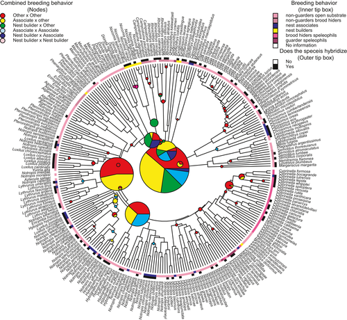
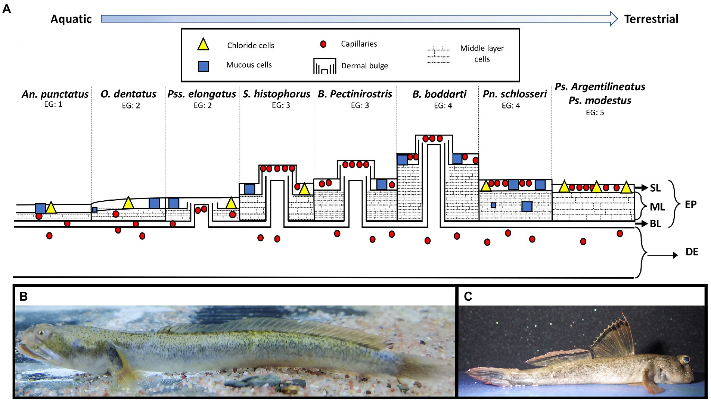
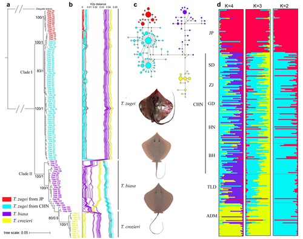

<head>
<meta charset="UTF-8" />
<meta name="viewport" content="width=device-width, initial-scale=1.0" />
<title>Corush Lab</title>

</head>
<body>

  

    
    <h1>Joel Corush</h1>
    <h3> Assistant Professor</h3>
    <h3> Evolutionary Ichthyologist</h3>

  

  <button class="tablinks" onclick="openTab(event,'About me')">About me</button>
  <button class="tablinks" onclick="openTab(event,'Research')">Research</button>
  <button class="tablinks" onclick="openTab(event,'Publications')">Publications</button>
  <button class="tablinks" onclick="openTab(event,'People')">People</button>
  <button class="tablinks" onclick="openTab(event,'PhD')">Ph.D Opportunities</button>
  <button class="tablinks" onclick="openTab(event,'Teaching')">Teaching</button>

  <h2>Joel Corush </h2>
    <h3>Assistant Professor  Evolutionary Ichthyologist Biology Department  Illinois Institute of Technology Robert A. Pritzker Science Center 3105 South Dearborn Street, Room 182 Chicago, IL 60616 email: jcorush @ illinoistech . edu</h3>
    
  <h3>Education</h3>
     <ul>
    <li>Postdoc - Illinois Natural History Survey at University of Illinois at Urbana-Champaign</li>
    <li>Postdoc - Wayne State University</li>
    <li>Ph.D. - Ecology and Evolutionary Biology - University of Tennessee - Knoxville</li>
    <li>B.A. - Biology - Drake University</li>
  </ul>

  <!-- Main introduction paragraph -->
  

    I use population genetics, phylogenetic comparative methods, and natural history to study trait evolution in fishes. My research focuses on how life-history traits—such as       breeding behavior and migration patterns—shape population connectivity and movement across landscapes within species, as well as hybridization rates between species. I then compare these behaviors across clades to identify patterns associated with diversification, trait correlations, and the evolution of complex behaviors. I also work to incorporate this information into conservation and management efforts.  
    Some major lines of research in my lab are: (1) the evolution of breeding behavior in North American minnows, 
     (2) the biogeography and life-history evolution of Indo-Pacific mudskippers, and (3) conservation. 
  

  <!-- Minnow section (image left, text right) -->
  

    

      
    

    

      

        I am interested in understanding how complex nesting behaviors evolve and the evolutionary consequences of this reproductive strategy. A recent phylogenetic comparative study demonstrated that nest association—using the nests of other species—significantly increases the likelihood of hybridization (<a href="https://academic.oup.com/jeb/article/34/3/486/7326628" 
   title="Corush et al. 2021" 
   target="_blank" 
   rel="noopener noreferrer">Corush et al. 2021</a>). My ongoing research examines the evolutionary pathways that lead to the development of complex breeding behaviors—such as nest building and parental guarding—and quantifies the rates of hybridization associated with specific nest-building strategies among North American minnows.
      

    

  

  

  <!-- Mudskipper section (image right, text left) -->
  

    

      
    

    

      

        Mudskippers are a semi-terrestrial group of fishes that spend much of their time on intertidal mudflats. 
        This lifestyle is associated with numerous behavioral, physiological, and morphological adaptations, and may 
        strongly influence biogeographical distribution. My research examines how an amphibious life history can shape 
        dispersal ability, population connectivity, and evolutionary diversification in this clade.
      

    

  

  
  

 
 <!-- Conservation section (image left, text right) -->
  

    

      
    

    

      

        I work with a number of spceis to address population srtucture, hybridization, demographic history, and effects of habiat modifications on threatened and endangered species as well as dispersal patterns of invasive speceis. I apply population and landscape genetics to a wide range of speceis including the Mottled Sculpin (<a href="https://link.springer.com/article/10.1007/s10641-025-01686-8" 
   title="Corush et al. 2025" 
   target="_blank" 
   rel="noopener noreferrer">Corush et al. 2025</a>), spring cavefishes
        (<a href="https://link.springer.com/article/10.1007/s10592-024-01640-8" 
   title="Cucalón et al. 2024" 
   target="_blank" 
   rel="noopener noreferrer">Cucalón et al. 2022</a>), sharpnose rays (<a href="https://onlinelibrary.wiley.com/doi/abs/10.1111/1749-4877.12614" 
   title="Qi et al. 2024" 
   target="_blank" 
   rel="noopener noreferrer">Qi et al. 2022</a>), Round Goby, Slenderwrist Burrowing Crayfish, and Ironcolor Shiner, to name a few. 
      

    

  

  
For a full list of publications see my <a href="https://scholar.google.com/citations?user=Xh3zefgAAAAJ&hl=en&oi=ao.html" 
   title="Google Scholar page" 
   target="_blank" 
   rel="noopener noreferrer">Google Scholar page</a>

  
Select publications:

  <ul>
    <li>Corush, J. B., Cucalón, R. V., Metzke, B. A., Tan, M., & Davis, M. A. (2025). Pleistocene glaciation and Anthropocene fragmentation influence genetic variation in the Illinois state–listed mottled sculpin (Cottus bairdii). Environmental Biology of Fishes, 1-18.</li>
    <li>Corush, J. B. (2024). Nest-Associating Minnows Prefer Occupying Longear Sunfish Nests Over Green Sunfish Nests. Northeastern Naturalist, 31(4), 479-487.</li>
    <li>Cucalón, R. V., Corush, J. B., Niemiller, M. L., Curtis, A. N., Hart, P. B., Kuhajda, B. R., ... & Tan, M. (2024). Population genomics and mitochondrial DNA reveal cryptic diversity in North American Spring Cavefishes (Amblyopsidae, Forbesichthys). Conservation Genetics, 25(6), 1283-1301.</li>
    <li>Corush, J. B., Pierson, T. W., Shiao, J. C., Katayama, Y., Zhang, J., & Fitzpatrick, B. M. (2022). Amphibious mudskipper populations are genetically connected along coastlines, but differentiated across water. Journal of Biogeography, 49(4), 767-779.</li>
    <li>Corush, J. B., Fitzpatrick, B. M., Wolfe, E. L., & Keck, B. P. (2021). Breeding behaviour predicts patterns of natural hybridization in North American minnows (Cyprinidae). Journal of Evolutionary Biology, 34(3), 486-500.</li>
    <li>Corush, J. B. (2019). Evolutionary patterns of diadromy in fishes: more than a transitional state between marine and freshwater. BMC Evolutionary Biology, 19(1), 168.</li>
    <li>Fitzpatrick, B. M., Ryan, M. E., Johnson, J. R., Corush, J., & Carter, E. T. (2015). Hybridization and the species problem in conservation. Current Zoology, 61(1), 206-216.</li>
  </ul>

  
Current lab members: 

  <ul>
    <!-- Paula (image left, text right) -->
  

    

      
    

    

      

         <li>Paula Rodriguez - Masters Student </li>
     <ul>
         <li>Paula joined the lab in Fall 2025. Paula is currently evaluating DNA extraction protocols to increase genetic yields from fish eggs. On her free time, Paula enjoys running, birding, and volunteering for educational programs to teach topics like math and bird conservation. She enjoys music and one of her favorite bands is Enjambre! If you ever want to study abroad, she also works as a study away peer advisor at Illinois Tech and helps undergrads find a program best suited to their interests for studying away!  </li>
     </ul> 
      

    

    
    
  
  <li>Reuel Anwar - Masters Student </li>
  <ul>
    <li>Reuel joined the lab in spring 2026. Reuel is currently working on population genetics of invasive round goby. He is identifyin genetic differences between Lake Michigan and Illinois River populations. </li>
   </ul> 
   

   
   
Future lab members: 

  <ul>
    <li>I am accepting Ph.D. and Masters Students for fall 2026 </li>
     <ul>
         <li>If you are interested in joining my lab, please email me with your CV and a paragraph about your interests related to my work. </li>
     </ul>  
  </ul>

  
I am recruting a Ph.D. (or Masters-to-Ph.D.) student to join my lab in Illinois Institute of Technology's Biology department starting Fall 2026!

  
I am open to students interested in a wide range of topics related to evolutionary biology, fish trait evolution, comparative phylogenetic methods, and population genetics. My lab uses a combination of molecular, analytical, and natural history methods. Some of the systems my lab  focus on include: 
  1) Hybridization and breeding behavior evolution in North American minnows, 
  2) Biogeography and amphibious behavior evolution in mudskippers, 
  3) Invasive round goby population dynamics in the Great Lakes region. 

  
IIT is in the heart of Chicago and the historic Bronzeville neighborhood. The Biology department is located a short walk from L stops on the Red and Green lines.  My lab also has an affilieation with the Field Museum, allowing access to collection and molecular lab space.
  
  
If you are interested in the above topics (in fishes or other organisms), or in topics related to my previously published papers, please reach out with a brief description of your interests and a CV.

  
Teaching  

    <li> Illinois Institute of Technology</li>
  <ul>
    <li>Molecular Biology (BIOL 515) - Fall 2025</li>
    <li>Urban Evology (BIOL 200) - Spring 2026</li>
  </ul> 
  <li>University Of Illinois</li>
  <ul>
    <li>Conservation of ‘extinct’ species (IB546) - graduate seminar. </li>
    <li>Phylogenetic Comparative Methods (IB546) - graduate seminar. (co-instructer) </li>
  </ul>

